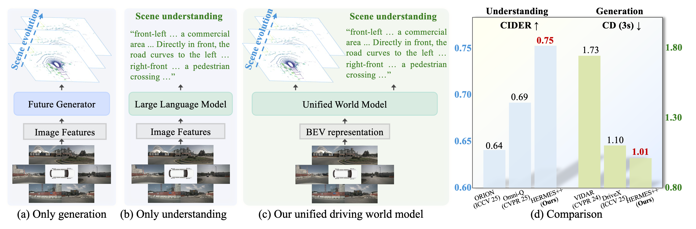
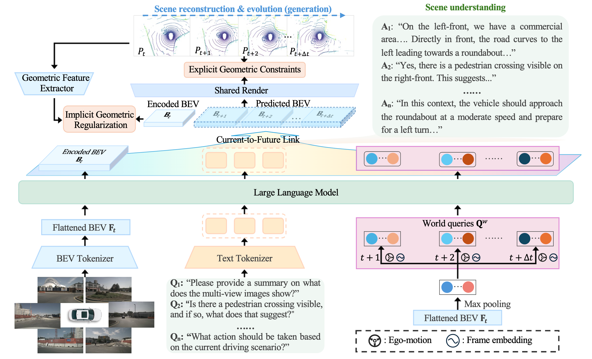
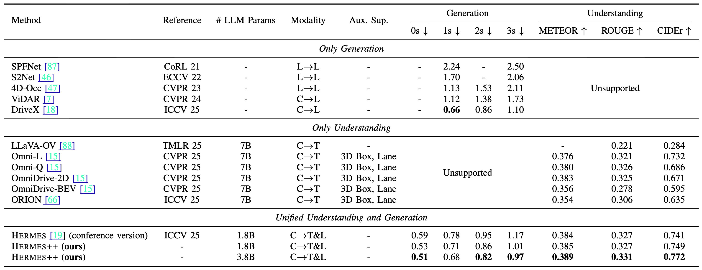
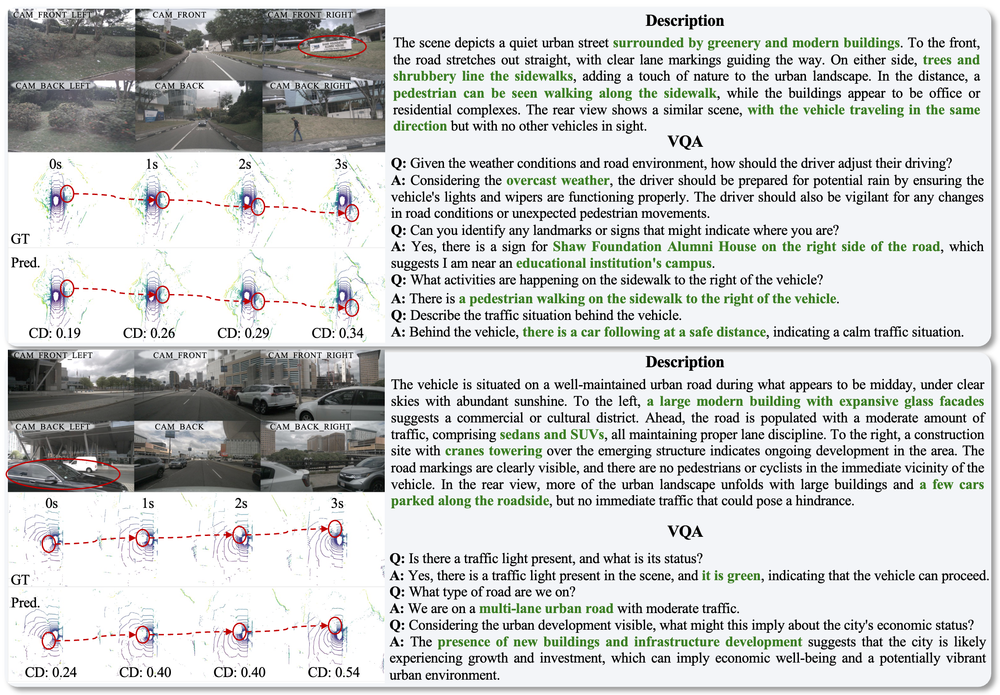

<div align="center">

<h3>HERMES++: Toward a Unified Driving World Model for 3D Scene Understanding and Generation</h3>

<a href="https://lmd0311.github.io/">Xin Zhou</a><sup>1</sup>,
<a href="https://dk-liang.github.io/">Dingkang Liang</a><sup>1</sup>,
<a href="https://scholar.google.com/citations?user=PVMQa-IAAAAJ&amp;hl=en">Xiwu Chen</a><sup>2</sup>,
Feiyang Tan<sup>2</sup>,
Dingyuan Zhang<sup>1</sup>,
<a href="https://scholar.google.com/citations?user=4uE10I0AAAAJ&amp;hl=en">Hengshuang Zhao</a><sup>3</sup>,
<a href="https://scholar.google.com/citations?user=UeltiQ4AAAAJ&amp;hl=en">Xiang Bai</a><sup>1</sup>

<p>
<sup>1</sup>Huazhong University of Science and Technology, <sup>2</sup>Mach Drive, <sup>3</sup>The University of Hong Kong
</p>

<p>
  <a href="https://arxiv.org/abs/2604.28196"></a>
  <a href="https://h-embodvis.github.io/HERMESV2/"></a>
  <a href="https://huggingface.co/H-EmbodVis/HERMESV2"></a>
  <a href="https://arxiv.org/abs/2501.14729"></a>
  <a href="https://github.com/LMD0311/HERMES"></a>
  <a href="LICENSE"></a>
</p>

</div>

## Abstract

Driving world models serve as a pivotal technology for autonomous driving by simulating environmental dynamics. However, existing approaches predominantly focus on future scene generation, often overlooking comprehensive 3D scene understanding. Conversely, while Large Language Models (LLMs) demonstrate impressive reasoning capabilities, they lack the capacity to predict future geometric evolution, creating a significant disparity between semantic interpretation and physical simulation. To bridge this gap, we propose HERMES++, a unified driving world model that integrates 3D scene understanding and future geometry prediction within a single framework. Our approach addresses the distinct requirements of these tasks through synergistic designs. First, a BEV representation consolidates multi-view spatial information into a structure compatible with LLMs. Second, we introduce LLM-enhanced world queries to facilitate knowledge transfer from the understanding branch. Third, a Current-to-Future Link is designed to bridge the temporal gap, conditioning geometric evolution on semantic context. Finally, to enforce structural integrity, we employ a Joint Geometric Optimization strategy that integrates explicit geometric constraints with implicit latent regularization to align internal representations with geometry-aware priors. Extensive evaluations on multiple benchmarks validate the effectiveness of our method. HERMES++ achieves strong performance, outperforming specialist approaches in both future point cloud prediction and 3D scene understanding tasks.

## TL; DR

- **Unified driving world model:** jointly supports 3D scene understanding and future geometry prediction.
- **BEV representation for LLMs:** compresses multi-view visual inputs into spatially consistent BEV tokens.
- **LLM-enhanced world queries:** transfer semantic and world knowledge from language reasoning to future generation.
- **Current-to-Future Link:** bridges current scene understanding and future geometric evolution.
- **Textual Injection:** uses text embeddings as conditioning signals for future scene generation.
- **Joint Geometric Optimization:** aligns latent features with geometry-aware priors through explicit and implicit constraints.

<div align="center">
  
</div>

## Updates

- **2025.04.30:** Release extended [paper](https://arxiv.org/abs/2604.28196) and code.
- **2025.06.26:** The HERMES conference version is accepted to ICCV 2025.
- **2025.01.24:** The HERMES paper and demo were released.

## Method Overview

HERMES++ unifies understanding and generation around a shared BEV representation:

1. Multi-view images are encoded and projected into BEV space.
2. BEV features are compressed into LLM-compatible visual tokens.
3. The LLM performs scene understanding and enriches world queries with semantic knowledge.
4. The Current-to-Future Link generates future latent representations conditioned on current BEV features, textual semantics, and future ego-motion.
5. A future geometry decoder predicts future point clouds, optimized with Joint Geometric Optimization.

<div align="center">
  
</div>

## Main Results

<div align="center">
  
</div>

## Qualitative Results

<div align="center">
  
</div>

## Demo

<div align="center">
  
  <br>
  <em>Demo 1</em>
</div>
<div align="center">
  
  <br>
  <em>Demo 2</em>
</div>
<div align="center">
  
  <br>
  <em>Demo 3</em>
</div>


## Getting Started

We provide separate setup, data, and usage documents:

- [Environment Setup](docs/Environment.md)
- [Data and Weights Preparation](docs/Data.md)
- [Usage Guide](docs/Usage.md)

After preparing the environment and data, train or evaluate with the configs in [`projects/configs/hermes`](projects/configs/hermes).

## To Do

- [x] Release demo.
- [x] Release checkpoints.
- [x] Release training code.
- [x] Release processed datasets.

## Acknowledgement

This project builds on HERMES, BEVFormer v2, InternVL, UniPAD, OmniDrive, DriveMonkey, and related open-source autonomous driving research. We thank the authors of these projects for their contributions to the community.

## Citation

If this repository is useful for your research, please consider citing these papers.

```bibtex
@article{zhou2026hermespp,
  title={HERMES++: Toward a Unified Driving World Model for 3D Scene Understanding and Generation},
  author={Zhou, Xin and Liang, Dingkang and Chen, Xiwu and Tan, Feiyang and Zhang, Dingyuan and Zhao, Hengshuang and Bai, Xiang},
  journal={arXiv preprint arXiv:2604.28196},
  year={2026}
}
@inproceedings{zhou2025hermes,
  title={HERMES: A Unified Self-Driving World Model for Simultaneous 3D Scene Understanding and Generation},
  author={Zhou, Xin and Liang, Dingkang and Tu, Sifan and Chen, Xiwu and Ding, Yikang and Zhang, Dingyuan and Tan, Feiyang and Zhao, Hengshuang and Bai, Xiang},
  booktitle={Proceedings of the IEEE/CVF International Conference on Computer Vision},
  year={2025}
}
```
